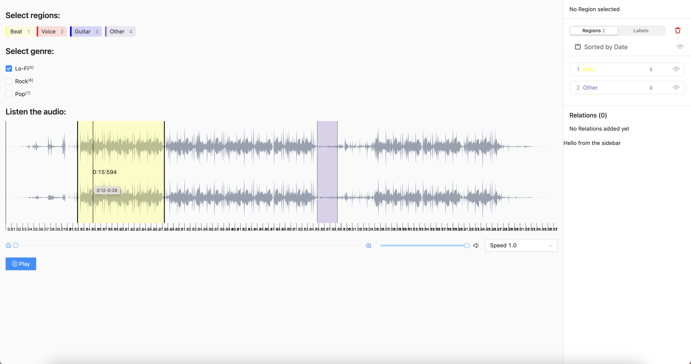

This is a [Next.js](https://nextjs.org/) project bootstrapped with [`create-next-app`](https://github.com/vercel/next.js/tree/canary/packages/create-next-app), setup to work with LabelStudio.

## What is this?

A sample project outlining the basic steps to setup and run LabelStudio in a NextJS application! 🎉

## What is this not?

A guided tutorial on the ways to work with or integrate LabelStudio. (Maybe coming in the future 🤔)

## Latest published LabelStudio version `1.4.0`

For ways to work with the existing stable version of LabelStudio frontend, please use the branch `ls-140` (this branch).
The code to run this is largely the same, but there are key differences not found in latest code on github.

### Getting Started

First, install the modules.

```bash
npm install
# or
yarn install
# or
pnpm install
```

Then, run the server.

```bash
npm run dev
# or
yarn dev
# or
pnpm dev
```

### Notes

Due to differing versions of React in play between LabelStudio and NextJS, `reactStrictMode` has been set to `false`.
This is important to fix the issues with LabelStudio not mounting correctly, without this you may be treated to a blank
screen even if there are no other errors. (This is being worked on internally to fix the issues presented by this
collision).

## It's alive! 🥳

Open [http://localhost:3000](http://localhost:3000) with your browser to see the result.




You can start editing the page by modifying `pages/index.tsx`. The page auto-updates as you edit the file.

[API routes](https://nextjs.org/docs/api-routes/introduction) can be accessed on [http://localhost:3000/api/hello](http://localhost:3000/api/hello). This endpoint can be edited in `pages/api/hello.ts`.

The `pages/api` directory is mapped to `/api/*`. Files in this directory are treated as [API routes](https://nextjs.org/docs/api-routes/introduction) instead of React pages.

## Learn More

To learn more about LabelStudio, please check out the following resources:

- [LabelStudio Documentation](https://labelstud.io/guide) - Learn more about LabelStudio itself!
- [LabelStudio Frontend Repo](https://github.com/heartexlabs/label-studio-frontend) - You can find examples in the examples folder here, and in code documentation.

To learn more about Next.js, take a look at the following resources:

- [Next.js Documentation](https://nextjs.org/docs) - learn about Next.js features and API.
- [Learn Next.js](https://nextjs.org/learn) - an interactive Next.js tutorial.

## Deploy on Vercel

The easiest way to deploy your Next.js app is to use the [Vercel Platform](https://vercel.com/new?utm_medium=default-template&filter=next.js&utm_source=create-next-app&utm_campaign=create-next-app-readme) from the creators of Next.js.

Check out our [Next.js deployment documentation](https://nextjs.org/docs/deployment) for more details.
